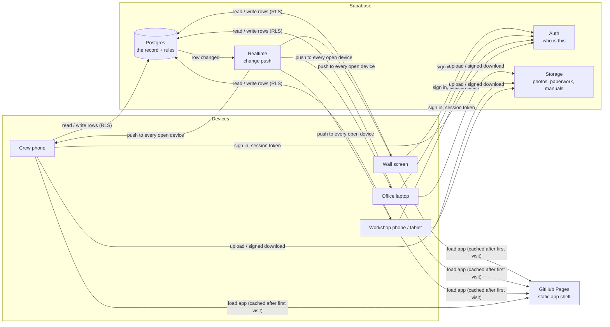
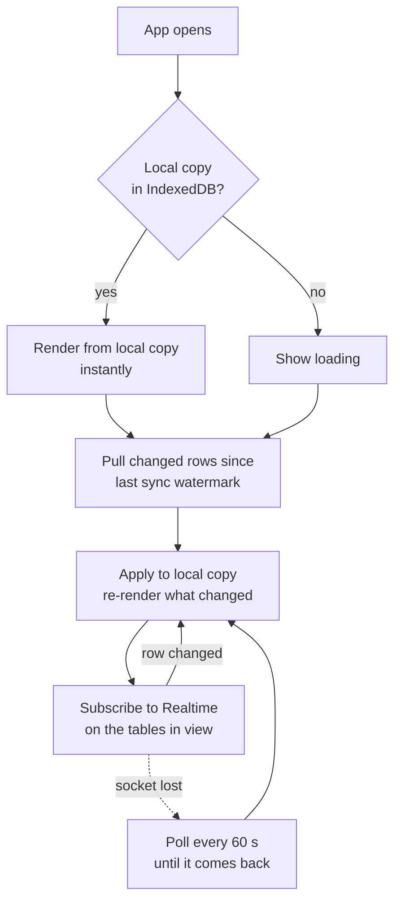
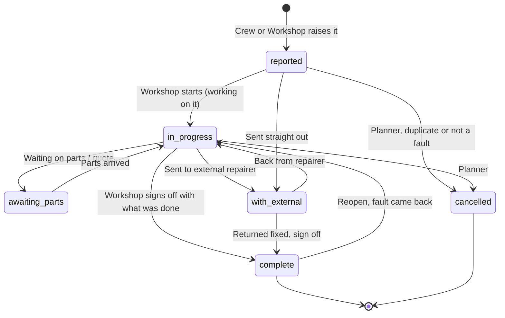
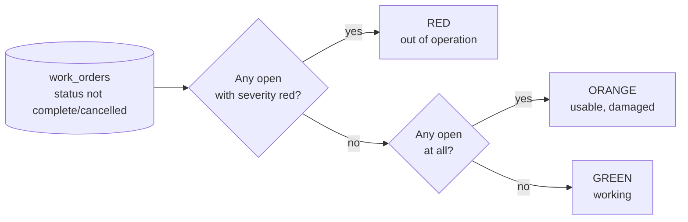
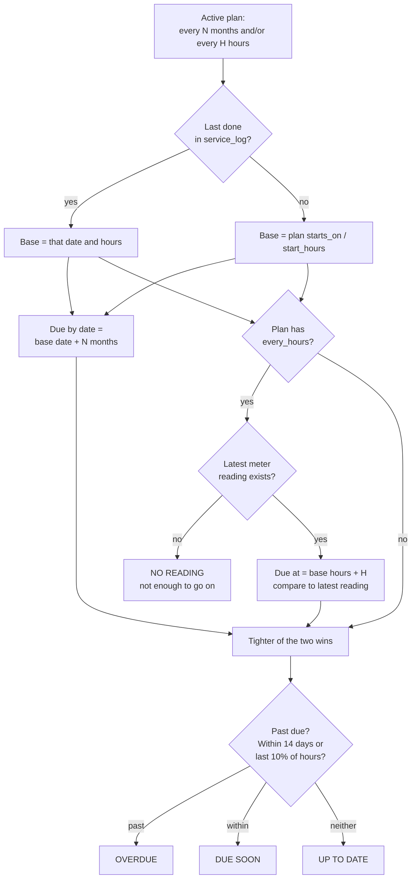
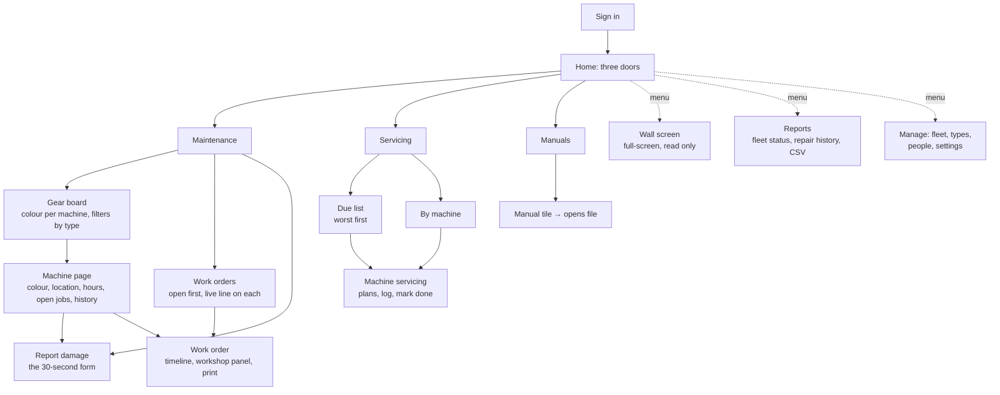

# RCK Workshop v2 — how it flows

*Design document 1 of the rebuild. Status: draft for discussion.*

This is the map we build from. It says who uses the app, what data exists, where
each piece of it lives, how it moves between a phone and the shared record, and
what the screens are. Nothing here is code yet; the point is to agree the shape
before any is written.

The current app (`/app.js` in this repository) does the same job and does it
well enough that the crew use it. What it lacks is structure: one 3,000-line
file, one shared key with no idea who is holding it, all data in `localStorage`,
and every rule about status and due dates living only in the browser. v2 keeps
what works and puts a spine under it.

---

## 1. What stays, what changes

| | Today (v1) | v2 |
|---|---|---|
| Purpose | Gear status, damage → work orders, servicing, manuals, wall screen | Same |
| Colour rule | Gear colour comes only from open work orders, never set by hand | Same rule, but computed **in the database** so every reader agrees |
| Who is who | A name typed into Settings; a device is "crew" or "workshop" | Each **person** signs in once; their role travels with them |
| Access | One public anon key, read/write for anyone holding it | Row-level security keyed to the signed-in person's role |
| Offline | `localStorage` cache + outbox, replayed on reconnect | Same idea, on **IndexedDB** (bigger, survives photos), same outbox pattern |
| Staying current | Poll every 20 s | **Realtime** push from Supabase, with polling only as a fallback |
| History | Client writes a `wo_updates` row after each change | Database **trigger** writes the event; a client cannot forget |
| Code | One file, hand-rolled router and store | Modules with one job each, typed, tested where the rules live |
| Hosting | GitHub Pages, no build | GitHub Pages, built by an Action on push |

Principles carried over unchanged, because they are why the crew use it:

- **Report damage in about 30 seconds**, one hand, bad signal.
- **The colour is never set by hand.** Green = working, orange = usable but
  damaged, red = out of operation.
- **Servicing is separate from breakdowns.** A service falling due does not
  change the colour.
- **Everything prints** with the RCK document look.
- **The wall screen is just the app** in a full-screen mode.

---

## 2. Who uses it

| Role | Who | Can |
|---|---|---|
| **Crew** | Operators, drivers, labourers | See every machine and its colour. Report damage. Update a location. Log an hour-meter reading. Read manuals. |
| **Workshop** | Fitters, mechanics | All of Crew, plus: work a job (status, updates, parts, external repairer, paperwork), sign off, log a service done. |
| **Planner** | Workshop lead / manager | All of Workshop, plus: manage the fleet, set up service plans, run reports, manage people and roles. |
| **Screen** | The wall PC or tablet | Read only. Shows the board. Never signs anything. |

One person, one login. The role is a column on their profile, changed by a
Planner. The wall screen signs in as its own read-only account so a stray tap
on the wall cannot close a job.

**Decision to make:** how people sign in. See §12.

---

## 3. The pieces and how they connect



The app is still a static site. There is no server of ours to run or patch.
Every rule that has to be true for everyone (colour, history, who may do what)
lives in Postgres as a view, trigger or policy. Every rule that only affects
what one person sees lives in the app.

---

## 4. Where data lives

| Data | Lives in | Why there |
|---|---|---|
| Who I am, my role, my session | Supabase Auth + `people` table; token cached on device | Needed before anything else loads; must be verifiable server-side |
| Fleet, work orders, events, service plans and log, meter readings, manuals list | Postgres | The shared record. Only one copy is true |
| Photos, external repairer paperwork, manual files | Supabase Storage (private bucket) | Big binary; served by signed URL so the bucket is not public |
| Gear colour, days down, next service due | **Nowhere.** Computed by SQL views from the tables above | Derived values drift if stored. A view cannot disagree with its inputs |
| Local copy of the record | IndexedDB on the device | App opens instantly and reads offline |
| Outbox of changes made offline | IndexedDB on the device | Replayed in order when signal returns |
| Photos taken offline | IndexedDB (blob), then Storage | The row goes in the outbox with a placeholder; the file follows |
| Per-device preferences (last tab, board filter) | `localStorage` | Convenience only; losing it costs nothing |

Retention: nothing is deleted from the record. Gear is *retired*, work orders
are *cancelled*, people are *deactivated*. Files are kept even when the row that
pointed at them goes.

---

## 5. The data model

```mermaid
erDiagram
  people ||--o{ work_orders : "reported_by / completed_by"
  people ||--o{ wo_events : "author"
  asset_types ||--o{ assets : "type"
  assets ||--o{ work_orders : "has"
  assets ||--o{ meter_readings : "has"
  assets ||--o{ service_plans : "has"
  assets ||--o{ service_log : "has"
  work_orders ||--o{ wo_events : "timeline"
  work_orders ||--o{ attachments : "photos, paperwork"
  service_plans ||--o{ service_log : "done under"
  service_log ||--o{ attachments : "paperwork"

  people {
    uuid id PK
    text name
    text role "crew | workshop | planner | screen"
    bool active
  }
  asset_types {
    text key PK
    text label
    int  rank "board order"
  }
  assets {
    uuid id PK
    text code "MIL-01"
    text name
    text type FK
    text make_model
    text location
    timestamptz location_at
    uuid location_by FK
    bool retired
  }
  meter_readings {
    uuid id PK
    uuid asset_id FK
    numeric hours
    date read_on
    uuid read_by FK
  }
  work_orders {
    uuid id PK
    bigint number "WO-0001"
    uuid asset_id FK
    text title
    text description
    text severity "orange | red"
    text status "see lifecycle"
    text repairer "internal | external"
    text external_company
    text external_ref
    numeric cost
    date target_date
    text work_done
    uuid reported_by FK
    timestamptz reported_at
    uuid completed_by FK
    timestamptz completed_at
  }
  wo_events {
    uuid id PK
    uuid work_order_id FK
    uuid author FK
    timestamptz at
    text kind "created | note | status | working | waiting | problem | looked | file | complete | reopen"
    text body
    jsonb meta
  }
  attachments {
    uuid id PK
    text owner_kind "work_order | service_log | manual"
    uuid owner_id
    text path "storage object path"
    text name
    text mime
    int  bytes
    uuid added_by FK
  }
  service_plans {
    uuid id PK
    uuid asset_id FK
    text name
    int  every_months
    int  every_hours
    date starts_on
    numeric start_hours
    bool active
  }
  service_log {
    uuid id PK
    uuid plan_id FK
    uuid asset_id FK
    text name
    date done_on
    numeric hours
    uuid done_by FK
    text note
  }
  manuals {
    uuid id PK
    text title
    text note
    uuid added_by FK
  }
```



What changed from v1 and why:

- **`people`** exists. Every `_by` column is a foreign key to a person, not a
  typed name. Names can be corrected once; history stays attached.
- **`asset_types`** is a table, not a free-text column, so the board order and
  labels are data. Adding a type is still one tap; it just inserts a row.
- **`meter_readings`** is a log, not a pair of columns on the asset. You can see
  when hours were read and by whom, and a mis-typed reading can be corrected
  without losing the previous one.
- **`attachments`** is one table for every kind of file, so "what paperwork is
  on file for this machine" is one query.
- **`wo_events.kind`** carries the v1 "what kind of update is this" vocabulary
  (working on it, waiting on, hit a problem, had a look, just info) as first-class
  values, so the live line on a card is a query, not a parse.

Views, computed on read:

- **`asset_status`** — for each asset: colour, open work order count, down
  since, days down, expected back. Built from `work_orders where status not in
  (complete, cancelled)`.
- **`service_due`** — for each active plan: last done (date, hours), next due by
  date, next due by hours, state (ok / due soon / overdue / no reading). The
  tighter of date and hours wins, exactly as v1.

---

## 6. How data moves

### Reading



Two things differ from v1. The pull asks only for rows changed since a
watermark (`updated_at > last_seen`) instead of re-downloading up to 17,000
rows every 20 seconds. And Realtime means the wall screen and the workshop
phone update the moment a crew phone raises a job, without polling.

### Writing


Rules that make this safe:

- **Every op carries an id chosen on the device**, so a replay after a dropped
  connection is an upsert, never a duplicate.
- **The outbox is ordered.** A "complete" cannot land before the "create" it
  belongs to.
- **Photos travel after their row.** The work order is raised with the photo
  held locally; the file uploads next, and the attachment row last. A job is
  never invisible because a photo is slow.
- **The database is the referee.** If two workshop phones sign off the same job
  offline, the second replay finds it already complete and the app shows the
  person that, rather than silently overwriting.

---

## 7. Work order lifecycle



Who may move it is a policy in the database, not a hidden button in the app:

| Transition | Crew | Workshop | Planner |
|---|---|---|---|
| Raise | ✓ | ✓ | ✓ |
| Add a note / photo | ✓ | ✓ | ✓ |
| Change status, target date, repairer | | ✓ | ✓ |
| Sign off (complete) | | ✓ | ✓ |
| Reopen | | ✓ | ✓ |
| Cancel | | | ✓ |
| Change severity after raising | | ✓ | ✓ |

A change of status always writes a `wo_events` row (by trigger), and the newest
event of kind `working / waiting / problem / looked / note` is the job's **live
line**, exactly as in v1.

---

## 8. Gear colour



This is the `asset_status` view. The app never stores a colour, and neither
does the wall screen, the fleet report, or a future export. Retired assets are
excluded from the board but keep their history.

---

## 9. When a service is due



Same rules as v1, moved into the `service_due` view so the Due tab, the
machine page and the fleet servicing report all agree to the day.

---

## 10. Screens and how they are used

### Screen map



### The flows that matter

**Report damage (Crew, on site, one hand).** Board → tap the machine → Report →
title, one line of description, *usable* or *out of operation*, camera → Raise.
Target: five taps and one short sentence. Works with no signal; the card shows
"waiting to send" until it goes.

**Work a job (Workshop).** Work orders → tap the job → the workshop panel is at
the top: status, target date, who is fixing it. Post an update by writing the
line and tapping which kind it is. Attach paperwork. Everything else (the
timeline, print) is below.

**Sign off.** One button, one required field: *what was done*. Cost is asked
for but not required. The gear goes green on every screen within a second.

**Log a service (Workshop).** Machine servicing page → the due plan → Mark done
→ date (today), hours (last reading offered), note. The clock restarts.

**Glance at the wall (Screen).** Counts across the top, then every open job
with its live line and due date, then machines needing attention. Refreshes
itself, keeps the screen awake, never asks for anything.

### Usability rules

- Every tap target is at least 48 px. Primary actions sit within thumb reach at
  the bottom of the screen.
- The sync dot is always visible: green live, orange changes waiting, red cannot
  reach the database, grey practice mode.
- Anything that changes the shared record says so back ("Raised WO-0142",
  "Signed off").
- A form remembers what was typed if the app is backgrounded mid-way.
- Lists open on what needs attention: open jobs first, overdue services first,
  red machines first.
- Print is a button on the thing being printed, never a separate screen.

---

## 11. How the code is organised

```
workshop-v2/
  src/
    app/          shell, router, sign-in, sync dot
    data/         Supabase client, IndexedDB cache, outbox, realtime, sync
    domain/       pure rules with tests: lifecycle, colour, service due, live line
    features/
      assets/     board, machine page, manage fleet
      work-orders/ list, work order, report damage, workshop panel
      servicing/  due list, by machine, plans, mark done
      manuals/
      reports/    fleet status, repair history, CSV
      screen/     wall screen
      people/     sign in, roles
    ui/           buttons, cards, forms, print document theme
  supabase/
    migrations/   numbered SQL, one change each, applied in order
    seed.sql      the standard fleet and types
  docs/           this file and the ones after it
```

Rules of the structure:

- **`domain/` has no imports from anywhere else** and no DOM. It is the rules,
  and it is where the tests are. The database views implement the same rules in
  SQL; a test fixture checks the two agree.
- **`data/` is the only thing that talks to Supabase or IndexedDB.** Features
  ask the store; they never fetch.
- **A feature owns its screens and nothing else's.** Shared bits go to `ui/`.
- **Migrations, not a re-runnable schema file.** Each change to the database is
  a new numbered file. The v1 "paste the whole file again" approach is what let
  tables silently stop matching the code.

---

## 12. Decisions to make before building

Recommendation first in each case.

**Sign-in.**
- *Recommended:* Supabase Auth with a magic link by email, one account per person,
  role on their profile. Free, no passwords, and it is what makes row-level
  security, audit trail and "who did this" real.
- *Alternative:* keep v1's shared key and typed name. Faster to start, but every
  later structure (permissions, history, wall screen safety) is built on sand.
- Cost of the recommendation: every crew member needs an email address they can
  open on their phone. Phone-number sign-in is possible later at SMS cost.

**Stack.**
- *Recommended:* Vite + TypeScript + Preact, deployed to GitHub Pages by a GitHub
  Action on push. Types are how the module boundaries above get enforced; Preact
  is small enough that a phone on 3G still opens fast.
- *Alternative:* plain ES modules, no build, as v1. Simpler to deploy by hand, but
  no types and no tests without adding tooling anyway.

**Storage privacy.**
- *Recommended:* one private bucket, files served by short-lived signed URLs.
  Requires sign-in.
- *Alternative:* public bucket as v1. Anyone with a link can open any photo or
  invoice forever.

**Where v2 lives.**
- *Recommended:* `workshop-v2/` in this repository alongside the other RCK apps,
  with its own Supabase project so v1 keeps running untouched until cut-over.
  Migrating v1's data is a one-off script, planned as its own phase.

---

## 13. Building it in stages

Each stage is usable on its own and is put in front of the workshop before the
next starts.

| Stage | Delivers | Done when |
|---|---|---|
| 0 Foundations | Repo layout, build, deploy to Pages, Supabase project, `people` + sign-in, sync dot | A fitter can sign in on their phone and see their name |
| 1 Fleet | `assets`, `asset_types`, board, machine page, manage fleet, seed the 33 machines | The board shows every machine, all green |
| 2 Damage → work order | Report damage, work orders list, work order page, lifecycle, events, photos, colour view | Crew raise a job offline; the board goes red when it lands |
| 3 Workshop | Workshop panel, updates with kinds, live line, external repairer, sign-off, print | A job goes from raised to signed off, and prints |
| 4 Wall screen | Full-screen board, realtime | The wall updates within a second of a phone |
| 5 Servicing | Plans, log, meter readings, due view, Due and By-machine tabs | The Due list matches a hand check for three machines |
| 6 Manuals and reports | Manuals shelf, fleet status, repair history, CSV | Reports match v1's for the same data |
| 7 Cut-over | Migrate v1 data, redirect v1, retire old key | The crew are on v2 and nobody asks for v1 |

Next document: **02 — the database**, with the migrations for stages 0–2
written out and the row-level policies per role.
