# RCK Workshop v2 — how it flows

*Design document 1 of the rebuild. Draft 4: adds the servicing loop driven by the weekly upload, the second colour, and the asset file.*

This is the map we build from. It says who uses the app, what data exists, where
each piece of it lives, how it moves between a phone and the shared record, and
what the screens are. Nothing here is code yet; the point is to agree the shape
before any is written.

The current app (`/app.js` in this repository) does the same job and does it
well enough that the crew use it. What it lacks is structure: one 3,000-line
file, one shared key with no idea who is holding it, all data in `localStorage`,
and every rule about status and due dates living only in the browser. v2 keeps
what works and puts a spine under it.

---

## 1. What stays, what changes

| | Today (v1) | v2 |
|---|---|---|
| Purpose | Gear status, damage → work orders, servicing, manuals, wall screen | Same, plus work orders **assigned** to a person or an outside company, and an owner's dashboard |
| Colour rule | Gear colour comes only from open work orders, never set by hand | Same rule, but computed **in the database** so every reader agrees |
| Who is who | A name typed into Settings; a device is "crew" or "workshop" | Each **person** signs in once; their tier travels with them. Subcontractors get a login too |
| Access | One public anon key, read/write for anyone holding it | Row-level security keyed to the signed-in person's tier and what is **assigned** to them |
| Offline | `localStorage` cache + outbox, replayed on reconnect | Same idea, on **IndexedDB** (bigger, survives photos), same outbox pattern |
| Staying current | Poll every 20 s | **Realtime** push from Supabase, with polling only as a fallback |
| History | Client writes a `wo_updates` row after each change | Database **trigger** writes the event; a client cannot forget |
| What a job must contain | Whatever was typed | **Required at raise** (asset, location, photo, what is wrong) and **required at close** (problem, fix, cost and purchases, or the subcontractor's invoice). The database refuses a close without them |
| A person's day | Nothing | A **daily diary** per person, built from what they did on every job, by time or by asset |
| Servicing | Plans by months and hours, a log filled in by hand | Intervals per asset by **hours, kilometres or months**, readings from a **weekly spreadsheet upload**, a **second colour** for service, and service jobs that are ordinary work orders with the same close-out |
| Asset history | A list of past work orders | The **asset file**: every job with its cost, every service, every reading, lifetime cost, all in one place |
| Code | One file, hand-rolled router and store | Modules with one job each, typed, tested where the rules live |
| Hosting | GitHub Pages, no build | GitHub Pages, built by an Action on push |

Principles carried over unchanged, because they are why the crew use it:

- **Report damage in about 30 seconds**, one hand, bad signal.
- **The colour is never set by hand.** Green = working, orange = usable but
  damaged, red = out of operation.
- **Servicing is separate from breakdowns.** A service falling due does not
  change the damage colour. It has a colour of its own, shown beside it.
- **Everything prints** with the RCK document look.
- **The wall screen is just the app** in a full-screen mode.

---

## 2. Who uses it

Five tiers. Each one sees everything the tier below it sees, and the boundary
between RCK and outside is the one that matters most.

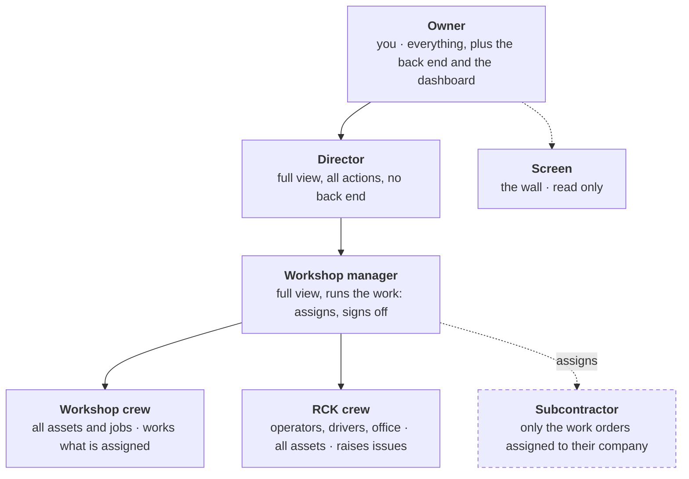

| Tier | Who | Sees | Does |
|---|---|---|---|
| **Owner** | You | Everything, plus a dashboard across the whole operation and the back end (Supabase project, deploys, settings, audit) | Anything |
| **Director** | Director | Everything the owner sees in the app, including the dashboard. No back end | Any action in the app, including people and their tiers |
| **Workshop manager** | Workshop lead | Everything operational: all assets, all jobs, servicing, reports, dashboard | Assigns jobs to people and subcontractors, signs off, manages the fleet and service plans |
| **Workshop crew** | Fitters, mechanics | All assets and jobs. **My work** shows what is assigned to them | Works a job: updates, parts, paperwork, marks their part done. Logs services |
| **RCK crew** | Operators, drivers, office staff | All assets and their colour, all jobs. **My work** shows anything assigned to them | Raises issues, updates locations, logs hours, reads manuals |
| **Subcontractor** | Sparky, hydraulics, glass, whoever is called in | **Only work orders assigned to their company**, and only the parts of them meant for outside eyes | Posts updates, attaches their report or invoice, marks their part done |
| **Screen** | The wall PC or tablet | The board | Nothing |

What each tier can see and do, in one table. A dot is "yes":

| | Owner | Director | Wkshp mgr | Wkshp crew | RCK crew | Subcontractor | Screen |
|---|:-:|:-:|:-:|:-:|:-:|:-:|:-:|
| Back end (Supabase, deploys, config) | ● | | | | | | |
| Dashboard | ● | ● | ● | | | | |
| People and tiers | ● | ● | | | | | |
| All assets and their colour | ● | ● | ● | ● | ● | | ● |
| All work orders | ● | ● | ● | ● | ● | | ● |
| Work orders assigned to me / my company | ● | ● | ● | ● | ● | ● | |
| Raise a work order | ● | ● | ● | ● | ● | | |
| Assign, reassign, set target date | ● | ● | ● | | | | |
| Post an update on an assigned job | ● | ● | ● | ● | ● | ● | |
| Internal notes (hidden from subcontractors) | ● | ● | ● | ● | ● | | |
| See other subcontractors' quotes and costs | ● | ● | ● | ● | | | |
| Sign off (complete) | ● | ● | ● | ● | | | |
| Cancel, change severity | ● | ● | ● | | | | |
| Servicing plans, intervals, thresholds | ● | ● | ● | | | | |
| Upload the weekly readings | ● | ● | ● | | | | |
| Raise a service job from the Due list | ● | ● | ● | ● | | | |
| Manuals | ● | ● | ● | ● | ● | | |
| Reports | ● | ● | ● | | | | |
| My own daily diary | ● | ● | ● | ● | ● | | |
| Anyone's daily diary, by person | ● | ● | | | | | |

A person has exactly one tier. Subcontractors belong to a **company**; the
assignment goes to the company, and every login at that company sees it. Office
staff who raise issues are RCK crew in this app unless made Director.

**Proposed and open:** the Director and the Workshop manager differ only in
people-and-tiers admin above. If the Director should be view-only instead, that
is one line in the policy. See §17.

## 3. The pieces and how they connect

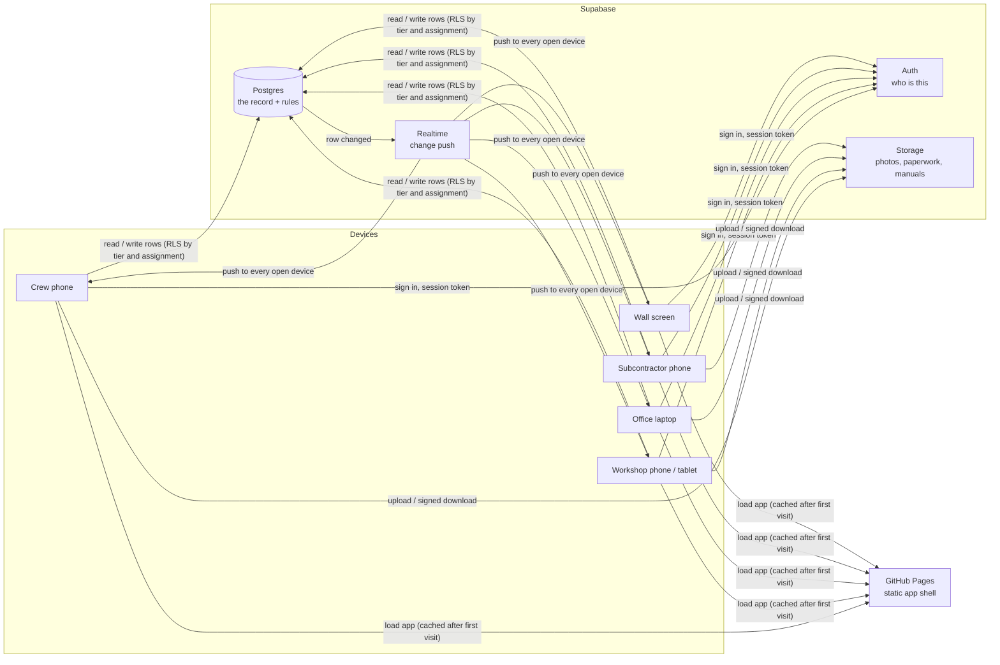

The app is still a static site. There is no server of ours to run or patch.
Every rule that has to be true for everyone (colour, history, who may do what,
what a subcontractor may see) lives in Postgres as a view, trigger or policy. The
same app is on every phone; the tier decides what it shows. Every rule that only affects
what one person sees lives in the app.

---

## 4. Where data lives

| Data | Lives in | Why there |
|---|---|---|
| Who I am, my tier, my company, my session | Supabase Auth + `people` and `companies` tables; token cached on device | Needed before anything else loads; must be verifiable server-side |
| Who a job is assigned to | `wo_assignments` in Postgres | It decides what a subcontractor is allowed to read, so it must be a row the policy can check, not a note |
| Fleet, work orders, events, service plans and log, meter readings, manuals list | Postgres | The shared record. Only one copy is true |
| Photos, external repairer paperwork, manual files | Supabase Storage (private bucket) | Big binary; served by signed URL so the bucket is not public |
| Gear colour, days down, next service due | **Nowhere.** Computed by SQL views from the tables above | Derived values drift if stored. A view cannot disagree with its inputs |
| Local copy of the record | IndexedDB on the device | App opens instantly and reads offline |
| Outbox of changes made offline | IndexedDB on the device | Replayed in order when signal returns |
| Photos taken offline | IndexedDB (blob), then Storage | The row goes in the outbox with a placeholder; the file follows |
| Per-device preferences (last tab, board filter) | `localStorage` | Convenience only; losing it costs nothing |

Retention: nothing is deleted from the record. Gear is *retired*, work orders
are *cancelled*, people are *deactivated*. Files are kept even when the row that
pointed at them goes.

---

## 5. The data model

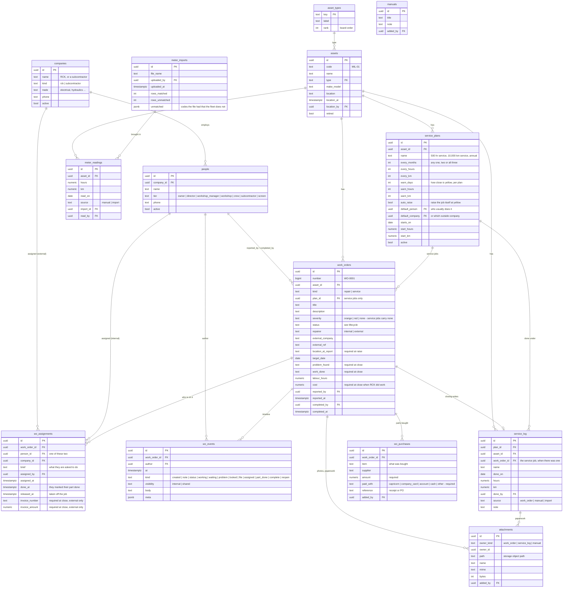

What changed from v1 and why:

- **`companies`** holds RCK itself and every subcontractor. A person belongs to
  one company. This is what lets a policy say "a subcontractor sees a job only
  if their company is assigned to it".
- **`wo_assignments`** is who is on a job. A job can have several at once (a
  fitter and a sparky), each with a one-line brief of what they are asked to do,
  and each marks their own part done. Taking someone off a job sets
  `released_at` rather than deleting, so the record shows who was asked.
- **`wo_events.visibility`** splits the timeline: `internal` notes never leave
  RCK; `shared` ones are what a subcontractor reads. The default is internal
  for RCK people and shared for subcontractors, so nothing leaks by accident.
- **`wo_purchases`** is the list of what was bought to fix a job: item,
  supplier, amount, and how it was paid (Capricorn, company card, on account,
  cash). It is what makes "cost to fix" auditable rather than a number typed
  from memory.
- **Close-out fields live on the row that owns them.** Problem found, work done
  and RCK's cost are on the work order; an outside company's invoice number and
  amount are on their assignment. The trigger that guards closing reads both.
- **`people`** exists. Every `_by` column is a foreign key to a person, not a
  typed name. Names can be corrected once; history stays attached.
- **`asset_types`** is a table, not a free-text column, so the board order and
  labels are data. Adding a type is still one tap; it just inserts a row.
- **`meter_readings`** is a log, not a pair of columns on the asset, with hours
  and kilometres side by side. Most rows will come from the weekly upload and
  say so (`source = import`, pointing at the file they came from); a reading
  typed on a phone is `manual`. A wrong reading is corrected without losing
  the previous one.
- **A service job is a work order** with `kind = service` and a `plan_id`. It
  is assigned, worked, updated and closed exactly like a repair, and closing it
  writes the `service_log` row that restarts the interval. The log is never
  filled in by hand for a job that exists; the manual and import sources are
  for history from before v2 and for "last serviced on" dates in the upload.
- **Every threshold is per plan, on the plan.** How many hours, kilometres or
  days before due counts as yellow is a column, not a constant, so a ute and a
  miller can differ.
- **`attachments`** is one table for every kind of file, so "what paperwork is
  on file for this machine" is one query.
- **`wo_events.kind`** carries the v1 "what kind of update is this" vocabulary
  (working on it, waiting on, hit a problem, had a look, just info) as first-class
  values, so the live line on a card is a query, not a parse.

Views, computed on read:

- **`person_day`** — every event a person caused, with the job and the asset it
  belongs to: work orders raised, updates posted, status changes, parts marked
  done, sign-offs, purchases added, services logged, hours read, locations
  updated, photos added. Filter it to one person and one day and it is their
  diary.
- **`my_work`** — for the signed-in person: every open assignment to them or
  their company, with the job and asset alongside. This is the "My work" screen
  and the whole of a subcontractor's app.
- **`asset_status`** — for each asset: colour, open work order count, down
  since, days down, expected back. Built from `work_orders where status not in
  (complete, cancelled)`.
- **`service_due`** — for each active plan: last done (date, hours, km), next
  due by each measure the plan uses, how far away that is, and a state of green,
  yellow, red or grey (no reading). The tightest measure wins. See §12.
- **`asset_service_colour`** — the worst state across an asset's active plans.
  The second dot on every card.
- **`asset_file`** — one asset, everything: identity, both colours, location,
  latest reading, open jobs, every closed job with its cost, every service, every
  reading, lifetime cost. See §14.

---

## 6. How data moves

### Reading

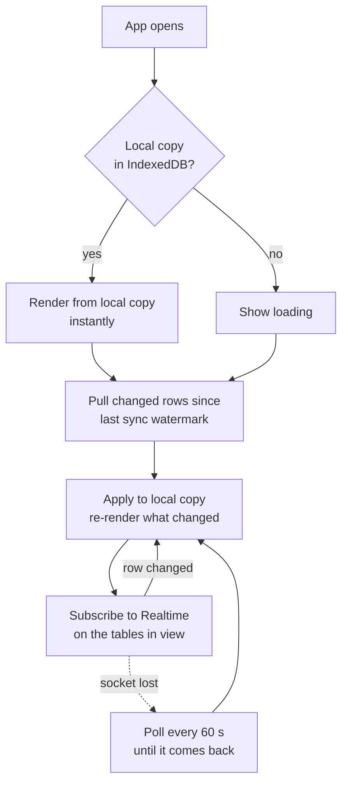

Two things differ from v1. The pull asks only for rows changed since a
watermark (`updated_at > last_seen`) instead of re-downloading up to 17,000
rows every 20 seconds. And Realtime means the wall screen and the workshop
phone update the moment a crew phone raises a job, without polling.

### Writing

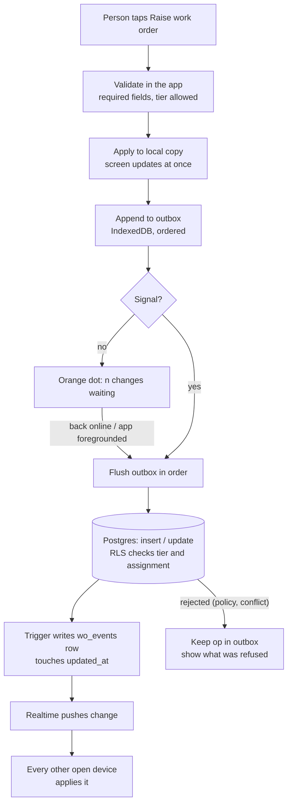

Rules that make this safe:

- **Every op carries an id chosen on the device**, so a replay after a dropped
  connection is an upsert, never a duplicate.
- **The outbox is ordered.** A "complete" cannot land before the "create" it
  belongs to.
- **Photos travel after their row.** The work order is raised with the photo
  held locally; the file uploads next, and the attachment row last. A job is
  never invisible because a photo is slow.
- **The database is the referee.** If two workshop phones sign off the same job
  offline, the second replay finds it already complete and the app shows the
  person that, rather than silently overwriting.

---

## 7. Work order lifecycle

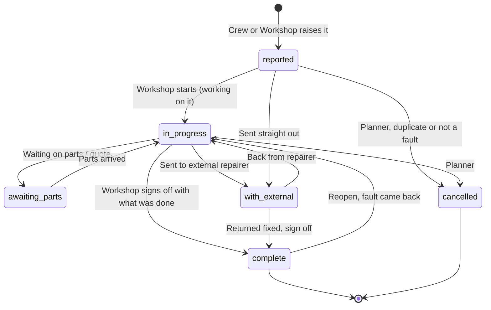

Who may move it is a policy in the database, not a hidden button in the app:

| Transition | RCK crew | Workshop crew | Subcontractor | Manager and up |
|---|:-:|:-:|:-:|:-:|
| Raise | ● | ● | | ● |
| Add a note or photo | ● | ● | on assigned jobs, shared only | ● |
| Mark my part done | on assigned jobs | on assigned jobs | on assigned jobs | ● |
| Change status, target date, repairer | | ● | | ● |
| Assign, reassign | | | | ● |
| Sign off (complete) | | ● | | ● |
| Reopen | | ● | | ● |
| Cancel, change severity | | | | ● |

A service job walks the same states. It starts at `reported` the moment it is
raised from the Due list, and it is closed the same way, with the same gate.

A change of status always writes a `wo_events` row (by trigger), and the newest
event of kind `working / waiting / problem / looked / note` is the job's **live
line**, exactly as in v1.

---

## 8. What a work order must contain

Two gates, both enforced by the database, both shown in the app as a checklist
that fills in as you go. The app will not offer the button until the list is
complete, and if a stale phone tries anyway, Postgres refuses the write and
says which field is missing.

### Raising one

| Required | Why |
|---|---|
| The asset | A job with no machine is a note, not a job |
| Where the asset is right now | Offered from the machine's last known location and GPS; must be confirmed or corrected |
| What is wrong, in a sentence | The title on every card and print |
| Usable or out of operation | Sets the colour |
| At least one photo | The workshop and any subcontractor see what the crew saw |

Optional at raise: a longer description, hour-meter reading, an expected-back
date. The photo rule has one wrinkle with bad signal: the app will not let
anyone tap **Raise** without a photo, and the outbox sends the job and its
photo as one unit, so the record never holds a job without one.

### Closing one

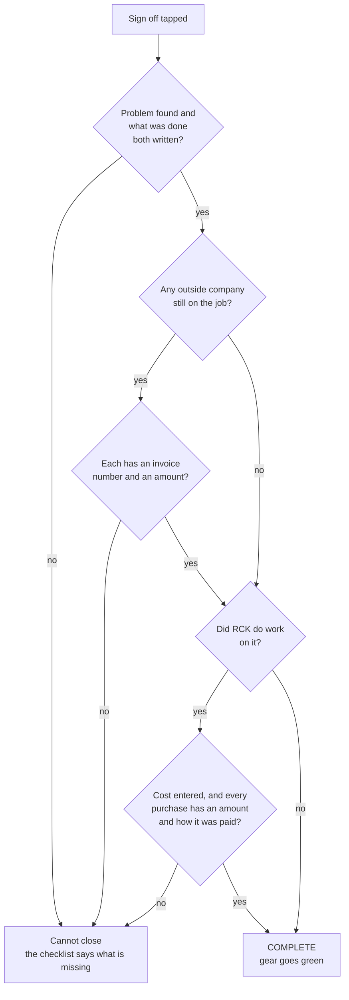

| Who did the work | Must be entered before close |
|---|---|
| RCK (internal) | **What the problem was.** **What was done to fix it.** **Cost to fix**, a number, zero allowed but typed. **Every purchase**: item, amount, how it was paid (Capricorn card, company card, on account with a supplier, cash, other). Labour hours are asked for, not required |
| An outside company | **Their invoice number** and **the amount on it**, against their assignment. Not the invoice's contents. The subcontractor can enter these themselves when they mark their part done; if they have not, the person closing must |
| Both | All of the above. Each company's numbers on its own assignment; RCK's on the job |
| A service job, any of the above | Everything for whoever did it, plus **the hours and/or kilometres on the machine at the service**, offered from the latest reading. That number is what restarts the interval, so it cannot be left blank |

The job's total cost is RCK's cost plus every invoice amount, worked out by a
view, never typed. The fleet cost report and the dashboard's "cost this month"
read the same view.

Cancelling is the only way to close a job without these, and only a manager or
above can cancel, with a reason that goes on the record.

---

## 9. Assigning work

This is the piece v1 does not have and the reason subcontractors get a login.
A job is raised by anyone at RCK; the workshop manager decides who is on it;
each person on it sees it under **My work** on their own phone; the workshop
signs it off.

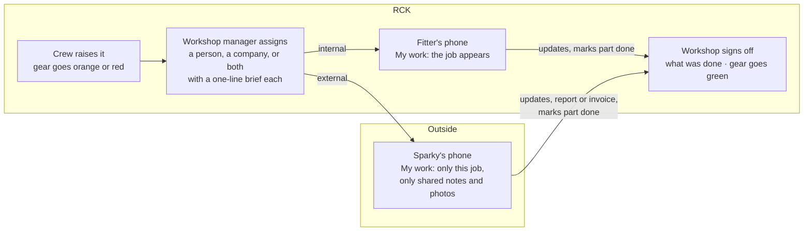

What a subcontractor's app is: a list of the jobs assigned to their company,
newest first, and nothing else. No board, no other assets, no servicing, no
menu. Opening a job shows the machine (code, name, where it is), what is wrong,
the brief they were given, the shared photos and notes, and three things they
can do: post an update, attach a file, mark their part done. When their part is
done the job stays visible to them until it is signed off, then drops off their
list. They never see internal notes, other companies' costs, or the sign-off
fields.

What **My work** is for RCK people: the same list, but reached from a **My
profile** button in the normal app, and showing everything, because they are
inside.

How someone finds out they have been assigned:

- The job appears in My work the next time the app is open, within a second if
  it already is. A count sits on the My profile button.
- A **push notification** when the app is installed to the home screen, on both
  iPhone and Android. This replaces the WhatsApp message.
- An **email** as a fallback for anyone who has not installed it.

Push and email need a small piece of back end (a database function that fires
when an assignment row is inserted). It is the one place v2 has server-side
code, and it is the owner's back end to look after. Which channels to switch on
is a decision in §17.

Cost and the outside: a subcontractor's invoice number and amount are recorded
against **their assignment**, not against the job as a whole, so two companies
on the same job never see each other's numbers. The job's total cost is the sum,
visible to workshop crew and up.

---

## 10. A person's day

Every RCK person has a diary that writes itself. Nobody fills it in; it is
built from what they did in the app: the jobs they raised, the updates they
posted, the parts they marked done, the jobs they signed off, the purchases
they added, the services they logged, the hours and locations they entered.

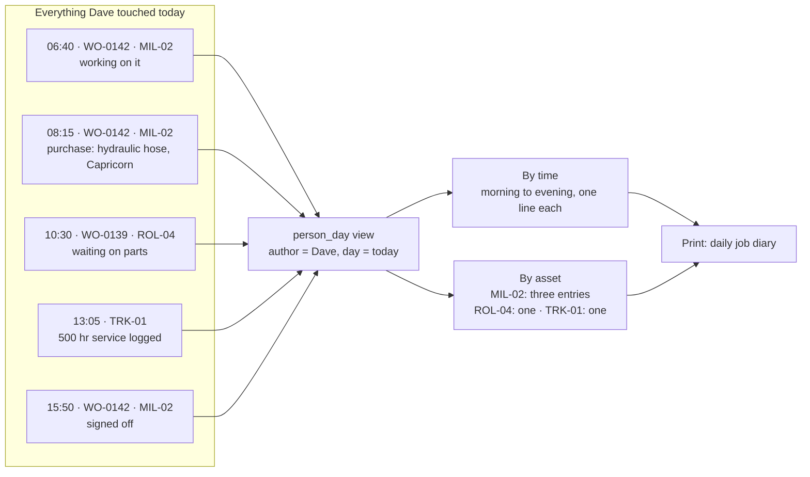

Who sees whose:

- **Everyone sees their own**, under My profile → My day. Yesterday and any
  day before, with a date picker.
- **Owner and Director see everyone's**, from a People list: tap a person, pick
  a day. Crew, workshop crew and office staff alike. A crew member cannot open
  another crew member's diary.
- **Proposed:** the Workshop manager sees workshop crew's diaries too, since
  they run that team. Say if not. See §17.

Two ways to read a day, one switch between them:

- **By time.** One line per event from the first to the last, each with the
  time, the machine, the job number and what happened. This is the daily job
  diary as it would be written by hand.
- **By asset.** The same events grouped under each machine touched that day,
  so "what did Dave do on the miller" is one glance.

Filters: the day (default today), and within it a machine or a job. A week
view lists the days with a count each, for the person who wants to look back.
Prints as a one-page daily diary in the RCK document look.

This costs nothing to keep: the events already exist because of §6, and
`person_day` is a view over them. What it needs is that every write carries
who did it, which the sign-in guarantees.

---

## 11. Gear colour

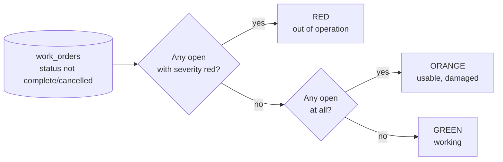

This is the `asset_status` view. The app never stores a colour, and neither
does the wall screen, the fleet report, or a future export. Retired assets are
excluded from the board but keep their history.

---

## 12. Proactive servicing: the second colour

Every asset carries two colours, and they answer different questions.

| | Answers | Green | Yellow / orange | Red | Grey |
|---|---|---|---|---|---|
| **Damage** (§11) | Can we use it today? | Working | Damaged, still usable | Out of operation | |
| **Service** | Is it looked after? | Nothing due inside the warning window | A service is close | A service is overdue | No reading, cannot tell |

On the gear board the damage colour is the card and the service colour is a
small second dot. On the servicing screens it is the other way round. Neither
ever changes the other: a truck can be green for damage and red for service,
and both are true.

### What a plan is

A plan is one service on one asset, with an interval in any of three measures
and a warning window in each:

| Asset | Plan | Every | Yellow when within |
|---|---|---|---|
| Ute | 10,000 km service | 10,000 km or 6 months | 500 km or 14 days |
| Miller | 500 hr service | 500 hours | 50 hours |
| Miller | Annual inspection | 12 months | 30 days |
| Roller | 250 hr grease and check | 250 hours | 25 hours |

Presets fill these in for a new asset, as v1 did; the numbers are then yours
to change on the asset's file. Each plan can also name who usually does it, a
person or an outside company, so raising the job pre-fills the assignment.

### How the colour is worked out

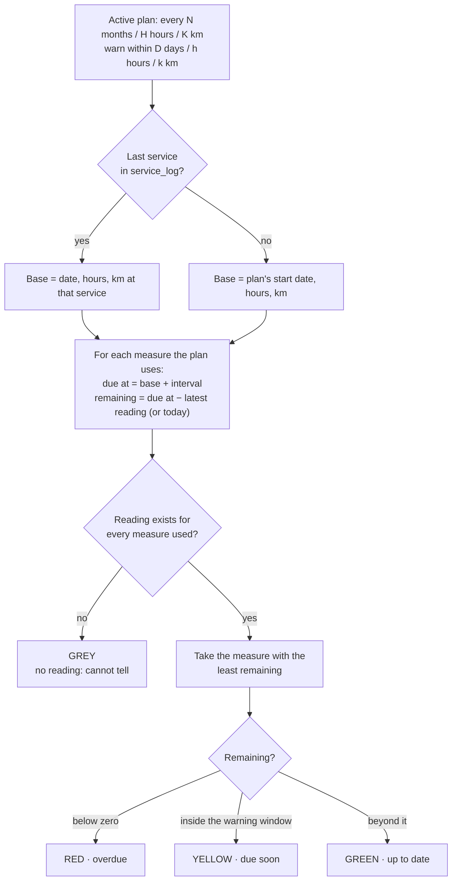

This is the `service_due` view, and the asset's colour is the worst of its
plans. It is computed on read, so the moment a new reading lands the colours
are right everywhere.

A service being due does **not** raise a job by itself while the asset is
green. Yellow and red are where jobs come from, in §13.

---

## 13. The weekly upload, and raising service jobs

The readings that drive servicing come from the spreadsheet you already
produce once a week: hours and kilometres for every asset, and the date it was
last serviced. Uploading it is the moment servicing moves.

```mermaid
flowchart LR
  xls["Weekly spreadsheet<br/>code · date · hours · km · last serviced"] --> up["Upload<br/>Owner, Director, Manager"]
  up --> match["Match rows to assets<br/>by code"]
  match --> review["Review before it lands<br/>matched · unmatched codes · readings lower than last"]
  review -- "confirm" --> readings[(meter_readings<br/>one row per asset, source = import)]
  readings --> due["service_due recomputes<br/>colours change"]
  due --> list["Due list<br/>red first, then yellow<br/>each with a Raise button"]
  list -- "one tap, or Raise all" --> job["Service work order<br/>kind = service · pre-filled from the plan<br/>assigned to the plan's usual person or company"]
  due -- "plans marked auto_raise" --> job
  job --> work["Worked like any job<br/>updates · parts · outside company"]
  work --> close["Closed through the same gate<br/>+ hours / km at service"]
  close --> log[(service_log<br/>written by the close)]
  log --> reset["Interval restarts<br/>asset goes green"]
  reset -. next week .-> xls
```

**The file.** Five columns, one row per asset, any order, headings on the first
line: `code`, `date`, `hours`, `km`, `last_serviced`. Blank cells are allowed
where a measure does not apply. CSV or Excel. The app offers a template to
download so the sheet is right the first time.

**Matching.** Rows are matched to assets by code (`MIL-01`, `TRK-03`). A code
the fleet does not know is listed, not silently dropped; a reading lower than
the last one is flagged as probably a typo but can be accepted (a replaced hour
meter is real). Nothing is written until **Confirm**.

**Last serviced.** If the sheet's date for an asset is later than the last
service on record, a `service_log` row is written with `source = import` and no
job behind it. This is how history from before v2 gets in, and how a service
done outside the app still restarts the clock.

**Raising the job.** After confirm, the Due list shows what changed: the
assets now red or yellow, worst first, with a **Raise** button on each and a
**Raise all** at the top. Raising creates a service work order pre-filled from
the plan (title, the asset, its location, the interval it is for) and assigned
to the plan's usual person or company, so the job is on someone's My work
before the upload screen is closed. A plan can be switched to `auto_raise`, in
which case its job is created the moment it turns yellow with nobody tapping;
off by default, so nothing appears that nobody asked for.

**Doing the job.** From there it is an ordinary work order: assigned, updated,
sent outside if the service is done by a dealer, and closed through the gate in
§8 with one extra required field, the hours or kilometres on the machine at the
service. Closing writes the service log and the asset goes green.

**Duplicates.** A plan with an open service job does not offer Raise again; the
Due list shows the job instead, with its live line.

---

## 14. The asset file

Everything about one machine, on one screen, for its whole life. The board
and every list are ways in; this is where they land.

| Section | What is in it |
|---|---|
| **Header** | Code, name, type, make and model. Both colours, large. Where it is and since when. Latest hours and kilometres and when they were read |
| **Now** | Open jobs, repair and service alike, each with its live line and who is on it. Services due or overdue, each with Raise |
| **Servicing** | Every plan with its interval, warning window, usual person, last done and next due. Edit here |
| **History** | Every closed job, newest first: date, what the problem was, what was done, who did it, RCK's cost, each outside invoice, total. Repairs and services in one list, filterable to either. Tap one for the full job and its print |
| **Readings** | Hours and kilometres over time, with the source of each. A wrong one is corrected here |
| **Cost** | Lifetime total, this year, last twelve months, split repair against service and RCK against outside |
| **Files** | Every photo and document from every job, and any added directly (registration, CoF, warranty) |

Nothing is ever removed from the file. A retired asset keeps it. Printing the
file gives the repair history report v1 had, and more.

---

## 15. Screens and how they are used

### Screen map

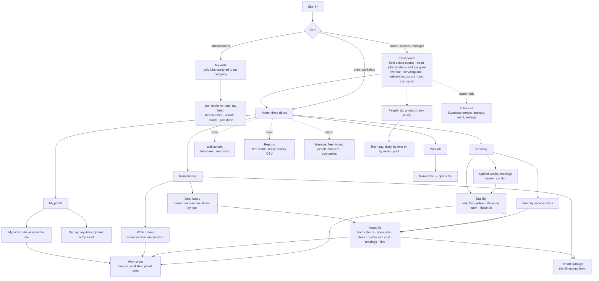

### The flows that matter

**Report damage (Crew, on site, one hand).** Board → tap the machine → Report →
title, one line of description, *usable* or *out of operation*, camera → Raise.
Target: five taps and one short sentence. Works with no signal; the card shows
"waiting to send" until it goes.

**Work a job (Workshop).** Work orders → tap the job → the workshop panel is at
the top: status, target date, who is fixing it. Post an update by writing the
line and tapping which kind it is. Attach paperwork. Everything else (the
timeline, print) is below.

**Assign a job (Workshop manager).** Open the job, tap Assign, pick a person
or a company from a short list (the ones used recently come first), write one
line of what they are to do, done. They are told. Add a second assignee the
same way.

**Work an assigned job (Subcontractor, or a fitter from My work).** My work,
tap the job. What is wrong and the brief are at the top, the machine and its
location under that, then shared notes and photos. Post an update, attach the
invoice, tap **My part is done**.

**Sign off.** One button, and a checklist above it that fills in as the job
goes along: problem found, what was done, cost, purchases with how they were
paid, or the subcontractor's invoice number and amount. The button is grey
until the list is complete. Then the gear goes green on every screen within a
second.

**Read someone's day (Owner, Director).** People → the person → today, or pick
a date. Switch between by time and by asset. Print it.

**Upload the week's readings (Owner, Director, Manager).** Servicing → Upload
→ pick the file. The review screen shows matched rows, unknown codes, and any
reading lower than the last. Confirm. The Due list opens on what is now red or
yellow, with Raise on each and Raise all at the top.

**Do a service (whoever it is assigned to).** It arrives in My work like any
job. Work it, then close it through the same gate plus the hours or kilometres
at the service. The asset goes green for service.

**Look up a machine's history (anyone at RCK).** Board → the asset → History.
Every job ever closed on it, with what was wrong, what was done, and what it
cost. Filter to repairs or services. Print the file.

**Look across everything (Owner, Director, Manager).** The dashboard opens
first. Counts of green, orange and red; open jobs grouped by status with who is
on each; anything overdue; services due this fortnight; which subcontractors
have jobs out and for how long; cost this month against last. Every number is a
tap away from the list behind it. The Owner also has a way through to the back
end from here; nobody else sees that door.

**Glance at the wall (Screen).** Counts across the top, then every open job
with its live line and due date, then machines needing attention. Refreshes
itself, keeps the screen awake, never asks for anything.

### Usability rules

- Every tap target is at least 48 px. Primary actions sit within thumb reach at
  the bottom of the screen.
- The sync dot is always visible: green live, orange changes waiting, red cannot
  reach the database, grey practice mode.
- Anything that changes the shared record says so back ("Raised WO-0142",
  "Signed off").
- A form remembers what was typed if the app is backgrounded mid-way.
- Lists open on what needs attention: open jobs first, overdue services first,
  red machines first.
- Print is a button on the thing being printed, never a separate screen.

---

## 16. How the code is organised

```
workshop-v2/
  src/
    app/          shell, router, sign-in, sync dot
    data/         Supabase client, IndexedDB cache, outbox, realtime, sync
    domain/       pure rules with tests: lifecycle, colour, service due, live line
    features/
      work-orders/ list, work order, report damage, workshop panel
      servicing/  due list, fleet by service colour, plans,
                  upload and review, raise service jobs
      assets/     board, asset file, manage fleet
      manuals/
      reports/    fleet status, repair history, CSV
      screen/     wall screen
      people/     sign in, my profile, my work, companies, tiers
      dashboard/  owner, director and manager overview
      diary/      my day, a person's day, print
      notify/     assignment push and email (server-side function)
    ui/           buttons, cards, forms, print document theme
  supabase/
    migrations/   numbered SQL, one change each, applied in order
    functions/    the one server-side piece: notify on assignment
    seed.sql      the standard fleet and types
  docs/           this file and the ones after it
```

Rules of the structure:

- **`domain/` has no imports from anywhere else** and no DOM. It is the rules,
  and it is where the tests are. The database views implement the same rules in
  SQL; a test fixture checks the two agree.
- **`data/` is the only thing that talks to Supabase or IndexedDB.** Features
  ask the store; they never fetch.
- **A feature owns its screens and nothing else's.** Shared bits go to `ui/`.
- **Migrations, not a re-runnable schema file.** Each change to the database is
  a new numbered file. The v1 "paste the whole file again" approach is what let
  tables silently stop matching the code.

---

## 17. Decisions to make before building

Recommendation first in each case. **Building started on the recommendations**
(stage 0, September 2026); each remains changeable, and the ones marked
*proposed* are still waiting on an answer.

**Sign-in.** Settled by the requirement: subcontractors need a login, so every
person has one. Supabase Auth, one account per person, tier and company on
their profile.
- *Recommended:* magic link by email for everyone. Free, no passwords.
- *Also worth having:* phone-number sign-in (a code by text) for subcontractors
  and crew who live on their phone and not their inbox. Small SMS cost per
  sign-in; can be added at any stage without changing anything else.

**Director versus Workshop manager.**
- *Proposed:* both have full view and every action; only the Director manages
  people and tiers. If the Director should be view-only, it is one line in the
  policy. Say which.

**Who sees the daily diaries.**
- *As asked:* everyone their own, Owner and Director everyone's.
- *Proposed addition:* the Workshop manager sees workshop crew's. Say if not.

**How people are told about an assignment.**
- *Recommended:* push notification to the installed app, with email as the
  fallback for anyone who has not installed it. This is what removes WhatsApp.
- *Alternative:* in-app only (the badge on My profile). No back end at all, but
  a subcontractor has to remember to open it.

**When a service job is raised.**
- *Recommended:* never while green. At yellow or red it is one tap from the Due
  list, or Raise all straight after the weekly upload. A plan can be switched
  to raise itself at yellow for the services nobody should have to think about
  (the annual CoF, say). Off by default.
- *Alternative:* raise every job automatically at yellow. Fewer taps, but jobs
  appear on people's phones that nobody decided on.

**The spreadsheet.**
- *Proposed:* five columns, `code`, `date`, `hours`, `km`, `last_serviced`,
  with a template to download. If the sheet you already produce has a different
  shape, send one and the upload will read that shape instead.

**Stack.**
- *Recommended:* Vite + TypeScript + Preact, deployed to GitHub Pages by a GitHub
  Action on push. Types are how the module boundaries above get enforced; Preact
  is small enough that a phone on 3G still opens fast.
- *Alternative:* plain ES modules, no build, as v1. Simpler to deploy by hand, but
  no types and no tests without adding tooling anyway.

**Storage privacy.** Settled by the requirement too: a subcontractor must not be
able to open another company's invoice, so files are in a private bucket and
served by short-lived signed links that respect the same assignment rule.

**Where v2 lives.**
- *Recommended:* `workshop-v2/` in this repository alongside the other RCK apps,
  with its own Supabase project so v1 keeps running untouched until cut-over.
  Migrating v1's data is a one-off script, planned as its own phase.

---

## 18. Building it in stages

Each stage is usable on its own and is put in front of the workshop before the
next starts.

| Stage | Delivers | Done when |
|---|---|---|
| 0 Foundations | Repo layout, build, deploy to Pages, Supabase project, `companies`, `people`, tiers, sign-in, sync dot | You, a fitter and a test subcontractor can each sign in and see a screen that matches their tier |
| 1 Fleet | `assets`, `asset_types`, board, machine page, manage fleet, seed the 33 machines | The board shows every machine, all green; the subcontractor login cannot see it |
| 2 Damage → work order | Report damage with the required fields and photo, work orders list, work order page, lifecycle, events, colour view | Crew raise a job offline; the board goes red when it lands; a job without a photo cannot be raised |
| 3 Assigning | Assignments, My profile and My work, the subcontractor app, shared and internal notes, part done | A sparky sees only the job they were given, posts an update, and the workshop sees it |
| 4 Workshop | Workshop panel, updates with kinds, live line, purchases, the close-out gate, invoice on assignment, sign-off, print | A job goes from raised to signed off with two assignees and prints; a close without cost or invoice is refused by the database |
| 4a Diary | My day, People and their day, by time and by asset, print | Dave's diary for yesterday matches what he actually did |
| 5 Telling people | Push and email on assignment | The sparky's phone buzzes when assigned, with nothing sent by hand |
| 6 Dashboard and wall | Owner and director dashboard, full-screen wall board, realtime | The wall and the dashboard update within a second of a phone |
| 7 Servicing | Plans with hours, km and months and per-plan warning windows, service colour, service jobs raised from the Due list and closed through the gate, the asset file | The Due list matches a hand check for three machines; a closed service job turns its asset green |
| 7a Weekly upload | Spreadsheet upload, matching, review, confirm, last-serviced import, Raise all, auto-raise plans | Monday's sheet goes in and every service job for the week is on someone's phone in five minutes |
| 8 Manuals and reports | Manuals shelf, fleet status, repair history, CSV | Reports match v1's for the same data |
| 9 Cut-over | Migrate v1 data, redirect v1, retire old key | The crew are on v2 and nobody asks for v1 |

Next document: **02 — the database**, with the migrations for stages 0–4
written out, the row-level policies per tier including the assignment rule
that fences a subcontractor in, and the close-out trigger.
